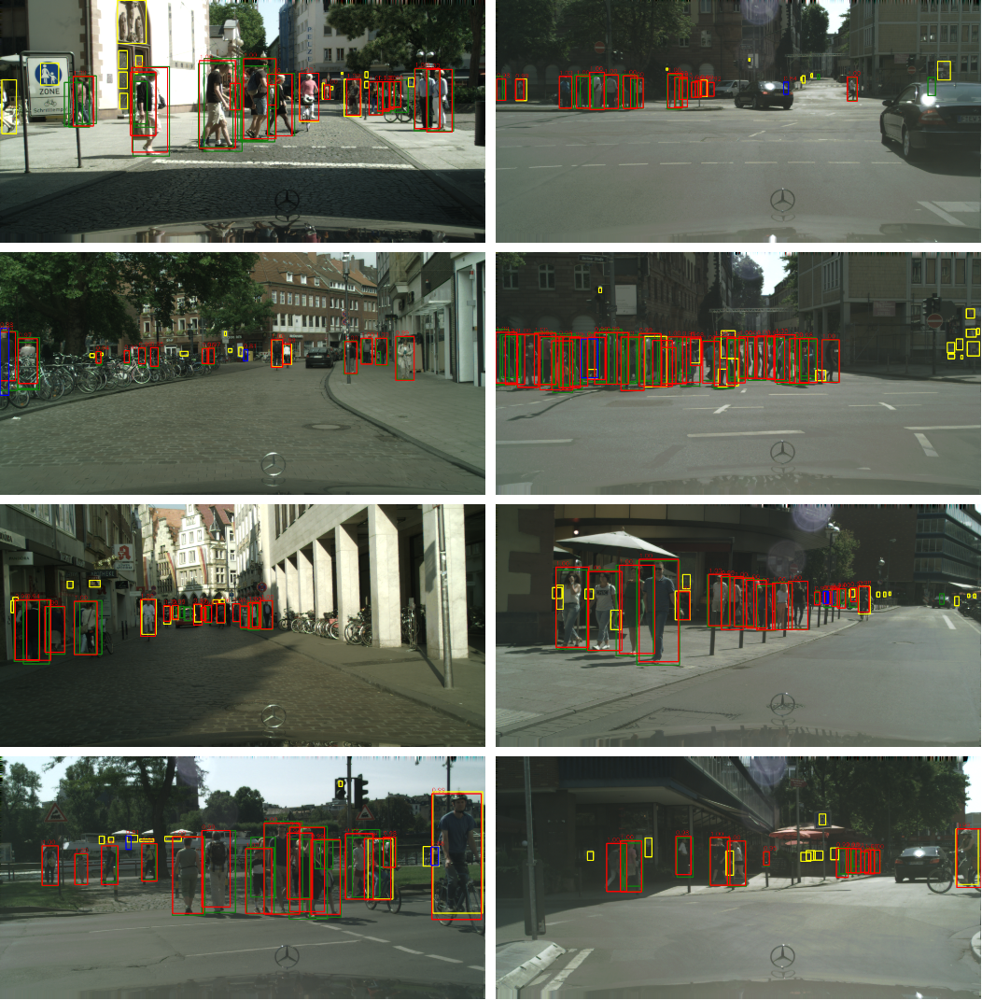

# Anonymous Pedestrian Detection Code (APDC)

This project is used for pedestrian detection using PyTorch 1.0.


## Installation

Check [INSTALL.md](INSTALL.md) for installation instructions.


### Multi-GPU training
We use internally `torch.distributed.launch` in order to launch
multi-gpu training. This utility function from PyTorch spawns as many
Python processes as the number of GPUs we want to use, and each Python
process will only use a single GPU.

```bash
export NGPUS=8
python -m torch.distributed.launch --nproc_per_node=$NGPUS /path_to_maskrcnn_benchmark/tools/train_net.py --config-file "path/to/config/file.yaml"
```
We provide four config files in 'configs/citypersons'.

## Setting Up CityPersons Dataset

```
|_ data/citypersons/leftImg8bit
|  |_ train
|  |_ val
|  |_ test
|_ data/citypersons/json_annotations
|  |_ citypersons_train.json
|  |_ citypersons_val.json
|  |_ citypersons_test.json
```

## Detections
Figure 1: Examples on the CityPersons dataset. The red, blue, green and yellow boxes indicate correctly detected pedestrians,
false positives, ground-truth, and ignored annotations, respectively.


## Reference

```
@misc{massa2018mrcnn,
author = {Massa, Francisco and Girshick, Ross},
title = {{maskrnn-benchmark: Fast, modular reference implementation of Instance Segmentation and Object Detection algorithms in PyTorch}},
year = {2018},
howpublished = {\url{https://github.com/facebookresearch/maskrcnn-benchmark}},
note = {Accessed: [Insert date here]}
}
```

